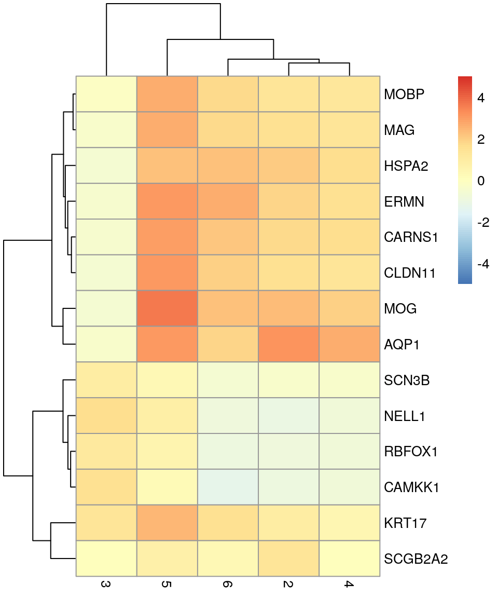

# Marker genes {#marker_genes}


## Background

Chapter on identifying marker genes for clusters by differential gene expression testing.


## Previous steps

*Code (hidden) to run steps from the previous chapters, to generate the `SpatialExperiment` object required for this chapter.*


## Marker genes

Identify marker genes by testing for differential gene expression between clusters.

We use the `findMarkers` implementation in `scran` [@Lun2016-dn], using a binomial test, which tests for genes that differ in the proportion expressed vs. not expressed between clusters. This is a more stringent test than the default t-tests, and tends to select genes that are easier to interpret and validate experimentally.


```r
library(scran)

# set gene names as row names for visualization purposes
rownames(spe) <- rowData(spe)$gene_name

# test for marker genes
markers <- findMarkers(spe, test = "binom", direction = "up")

# returns a list with one DataFrame per cluster
markers
```

```
## List of length 6
## names(6): 1 2 3 4 5 6
```


```r
library(pheatmap)

# plot log-fold changes for one cluster over all other clusters
# selecting cluster 1
interesting <- markers[[1]]
best_set <- interesting[interesting$Top <= 5, ]
logFCs <- getMarkerEffects(best_set)

pheatmap(logFCs, breaks = seq(-5, 5, length.out = 101))
```




```r
library(scater)

# plot log-transformed normalized expression of top genes for one cluster
top_genes <- head(rownames(interesting))

plotExpression(spe, x = "label", features = top_genes)
```


