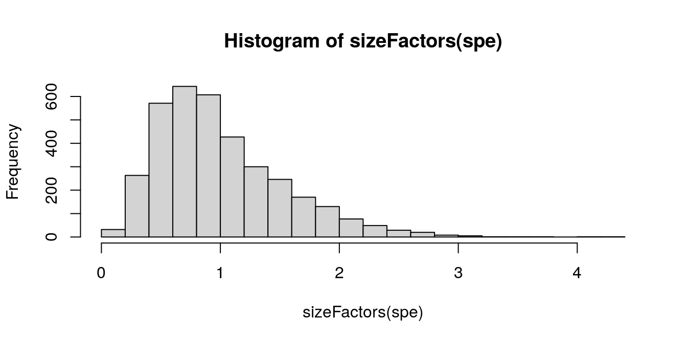

# Normalization


## Background

Details on normalization in single-cell and spatial data.


## Previous steps

*Code to run steps from the previous chapters, to generate the `SpatialExperiment` object required for this chapter.*


```r
# ---------
# load data
# ---------

library(SpatialExperiment)
library(STexampleData)

spe <- load_data("Visium_humanDLPFC")

# --------------------
# quality control (QC)
# --------------------

library(scater)

# subset to keep only spots over tissue
spe <- spe[, spatialData(spe)$in_tissue == 1]

# identify mitochondrial genes
is_mito <- grepl("(^MT-)|(^mt-)", rowData(spe)$gene_name)

# calculate per-spot QC metrics and store in colData
spe <- addPerCellQC(spe, subsets = list(mito = is_mito))

# select QC thresholds
qc_lib_size <- colData(spe)$sum < 500
qc_detected <- colData(spe)$detected < 250
qc_mito <- colData(spe)$subsets_mito_percent > 30
qc_cell_count <- colData(spe)$cell_count > 12

# combined set of discarded spots
discard <- qc_lib_size | qc_detected | qc_mito | qc_cell_count
colData(spe)$discard <- discard

# filter low-quality spots
spe <- spe[, !colData(spe)$discard]
```


## Log-transformed normalized counts

Calculate log-transformed normalized counts (abbreviated as "logcounts"), using pool-based size factors and deconvolution to the spot level.

We use normalization methods from `scater` [@McCarthy2017] and `scran` [@Lun2016], which were originally developed for single-cell RNA sequencing data. We make the assumption that these methods can be applied here by treating spots as equivalent to cells.

Since we have only a single sample, there are no blocking factors in the experimental design.


```r
library(scran)

# quick clustering for pool-based size factors
set.seed(123)
qclus <- quickCluster(spe)
table(qclus)
```

```
## qclus
##   1   2   3   4   5   6   7   8   9  10 
## 372 245 254 744 415 230 394 299 492 137
```

```r
# calculate size factors and store in object
spe <- computeSumFactors(spe, cluster = qclus)

summary(sizeFactors(spe))
```

```
##    Min. 1st Qu.  Median    Mean 3rd Qu.    Max. 
##  0.1334  0.6093  0.8844  1.0000  1.2852  4.2475
```

```r
hist(sizeFactors(spe), breaks = 20)
```



```r
# calculate logcounts (log-transformed normalized counts) and store in object
spe <- logNormCounts(spe)

# check
assayNames(spe)
```

```
## [1] "counts"    "logcounts"
```

```r
dim(counts(spe))
```

```
## [1] 33538  3582
```

```r
dim(logcounts(spe))
```

```
## [1] 33538  3582
```


