# Quality control

## Background

Quality control (QC) procedures at the spot level aim to remove low-quality spots before further analysis. Low-quality spots can occur due to problems during library preparation or other experimental procedures. Examples include large proportions of dead cells due to cell damage during library preparation, and low mRNA capture efficiency due to inefficient reverse transcription or PCR amplification.

These spots are usually removed prior to further analysis, since otherwise they tend to create problems during downstream analyses such as clustering. For example, problematic spots that are not removed could show up as separate clusters, which may be misidentified as distinct cell types.

Low-quality spots can be identified according to several characteristics, including:

- library size (i.e. total UMI counts per spot)

- number of expressed features (i.e. number of genes with non-zero UMI counts per spot)

- proportion of reads mapping to mitochondrial genes (a high proportion indicates cell damage)

- number of cells per spot (unusually high values can indicate problems)

Low library size or low number of expressed features can indicate poor mRNA capture rates, e.g. due to cell damage and missing mRNAs, or low reaction efficiency. A high proportion of mitochondrial reads indicates cell damage, e.g. partial cell lysis leading to leakage and missing cytoplasmic mRNAs, with the resulting reads therefore concentrated on the remaining mitochondrial mRNAs that are relatively protected inside the mitochondrial membrane. Unusually high numbers of cells per spot can indicate problems during cell segmentation.

The first three characteristics listed above are also used for QC in scRNA-seq data. However, the expected distributions for high-quality spots are different (compared to high-quality cells in scRNA-seq), since spots may contain zero, one, or multiple cells.


## Load data


```r
library(SpatialExperiment)
library(STexampleData)

# load object
spe <- Visium_humanDLPFC()
```


## Plot data

As an initial check, plot the spatial coordinates (spots) in x-y dimensions on the tissue slide, to check that the object has loaded correctly and that the orientation is as expected.

We use visualization functions from the [ggspavis](https://github.com/lmweber/ggpavis) package to generate plots.


```r
library(ggspavis)
```


```r
# plot spatial coordinates (spots)
plotSpots(spe)
```


## Calculate QC metrics

We calculate the QC metrics described above with a combination of methods from the `scater` [@McCarthy2017] package (for metrics that are also used for scRNA-seq data, where we treat spots as equivalent to cells) and our own functions.

The QC metrics from `scater` can be calculated and added to the `SpatialExperiment` object as follows. Here, we also identify mitochondrial reads using their gene names, and pass these as an argument to `scater`.

First, we subset the object to keep only spots over tissue. The remaining spots are background spots, which we are not interested in.


```r
library(scater)
```


```r
# subset to keep only spots over tissue
spe <- spe[, spatialData(spe)$in_tissue == 1]
dim(spe)
```

```
## [1] 33538  3639
```


```r
# identify mitochondrial genes
is_mito <- grepl("(^MT-)|(^mt-)", rowData(spe)$gene_name)
table(is_mito)
```

```
## is_mito
## FALSE  TRUE 
## 33525    13
```

```r
rowData(spe)$gene_name[is_mito]
```

```
##  [1] "MT-ND1"  "MT-ND2"  "MT-CO1"  "MT-CO2"  "MT-ATP8" "MT-ATP6" "MT-CO3" 
##  [8] "MT-ND3"  "MT-ND4L" "MT-ND4"  "MT-ND5"  "MT-ND6"  "MT-CYB"
```

```r
# calculate per-spot QC metrics and store in colData
spe <- addPerCellQC(spe, subsets = list(mito = is_mito))
head(colData(spe))
```

```
## DataFrame with 6 rows and 23 columns
##                    cell_count ground_truth     sample_id pxl_col_in_fullres
##                     <integer>     <factor>   <character>          <integer>
## AAACAAGTATCTCCCA-1          6       Layer3 sample_151673               8468
## AAACAATCTACTAGCA-1         16       Layer1 sample_151673               2807
## AAACACCAATAACTGC-1          5       WM     sample_151673               9505
## AAACAGAGCGACTCCT-1          2       Layer3 sample_151673               4151
## AAACAGCTTTCAGAAG-1          4       Layer5 sample_151673               7583
## AAACAGGGTCTATATT-1          6       Layer6 sample_151673               8064
##                    pxl_row_in_fullres         barcode_id in_tissue array_col
##                             <integer>        <character> <integer> <integer>
## AAACAAGTATCTCCCA-1               9791 AAACAAGTATCTCCCA-1         1        50
## AAACAATCTACTAGCA-1               5769 AAACAATCTACTAGCA-1         1         3
## AAACACCAATAACTGC-1               4068 AAACACCAATAACTGC-1         1        59
## AAACAGAGCGACTCCT-1               9271 AAACAGAGCGACTCCT-1         1        14
## AAACAGCTTTCAGAAG-1               3393 AAACAGCTTTCAGAAG-1         1        43
## AAACAGGGTCTATATT-1               3665 AAACAGGGTCTATATT-1         1        47
##                    array_row         x         y       sum  detected
##                    <integer> <integer> <integer> <numeric> <numeric>
## AAACAAGTATCTCCCA-1       102      8468      9791      8458      3586
## AAACAATCTACTAGCA-1        43      2807      5769      1667      1150
## AAACACCAATAACTGC-1        19      9505      4068      3769      1960
## AAACAGAGCGACTCCT-1        94      4151      9271      5433      2424
## AAACAGCTTTCAGAAG-1         9      7583      3393      4278      2264
## AAACAGGGTCTATATT-1        13      8064      3665      4004      2178
##                    subsets_mito_sum subsets_mito_detected subsets_mito_percent
##                           <numeric>             <numeric>            <numeric>
## AAACAAGTATCTCCCA-1             1407                    13              16.6351
## AAACAATCTACTAGCA-1              204                    11              12.2376
## AAACACCAATAACTGC-1              430                    13              11.4089
## AAACAGAGCGACTCCT-1             1316                    13              24.2223
## AAACAGCTTTCAGAAG-1              651                    12              15.2174
## AAACAGGGTCTATATT-1              621                    13              15.5095
##                        total         barcode_id in_tissue array_col array_row
##                    <numeric>        <character> <integer> <integer> <integer>
## AAACAAGTATCTCCCA-1      8458 AAACAAGTATCTCCCA-1         1        50       102
## AAACAATCTACTAGCA-1      1667 AAACAATCTACTAGCA-1         1         3        43
## AAACACCAATAACTGC-1      3769 AAACACCAATAACTGC-1         1        59        19
## AAACAGAGCGACTCCT-1      5433 AAACAGAGCGACTCCT-1         1        14        94
## AAACAGCTTTCAGAAG-1      4278 AAACAGCTTTCAGAAG-1         1        43         9
## AAACAGGGTCTATATT-1      4004 AAACAGGGTCTATATT-1         1        47        13
##                            x         y
##                    <integer> <integer>
## AAACAAGTATCTCCCA-1      8468      9791
## AAACAATCTACTAGCA-1      2807      5769
## AAACACCAATAACTGC-1      9505      4068
## AAACAGAGCGACTCCT-1      4151      9271
## AAACAGCTTTCAGAAG-1      7583      3393
## AAACAGGGTCTATATT-1      8064      3665
```


## Selecting thresholds

The simplest option to apply the QC metrics is to select thresholds for each metric, and remove any spots that do not meet the thresholds for one or more metrics. Exploratory visualizations can be used to help select appropriate thresholds, which may differ depending on the dataset.

Here, we use visualizations to select thresholds for several QC metrics in our human DLPFC dataset: (i) library size, (ii) number of expressed genes, (iii) proportion of mitochondrial reads, and (iv) number of cells per spot.


### Library size

Library size represents the total sum of UMI counts per spot. This is included in the column labeled `sum` in the `scater` output.

Plot a histogram of the library sizes across spots.


```r
# histogram of library sizes
hist(colData(spe)$sum, breaks = 20)
```

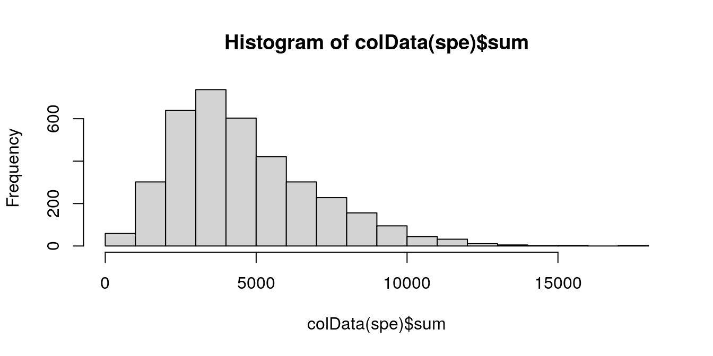

The distribution is relatively smooth, and there are no obvious issue such as a spike at very low library sizes.

We also plot the library sizes against the number of cells per spot (which is available for this dataset). This is to check that we are not inadvertently removing a biologically meaningful group of spots. The horizontal line (argument `threshold`) shows our first guess at a possible filtering threshold for library size based on the histogram.


```r
# plot library size vs. number of cells per spot
plotQC(spe, type = "scatter", 
       metric_x = "cell_count", metric_y = "sum", 
       threshold_y = 500)
```

```
## `geom_smooth()` using formula 'y ~ x'
```

```
## `stat_bin()` using `bins = 30`. Pick better value with `binwidth`.
## `stat_bin()` using `bins = 30`. Pick better value with `binwidth`.
```

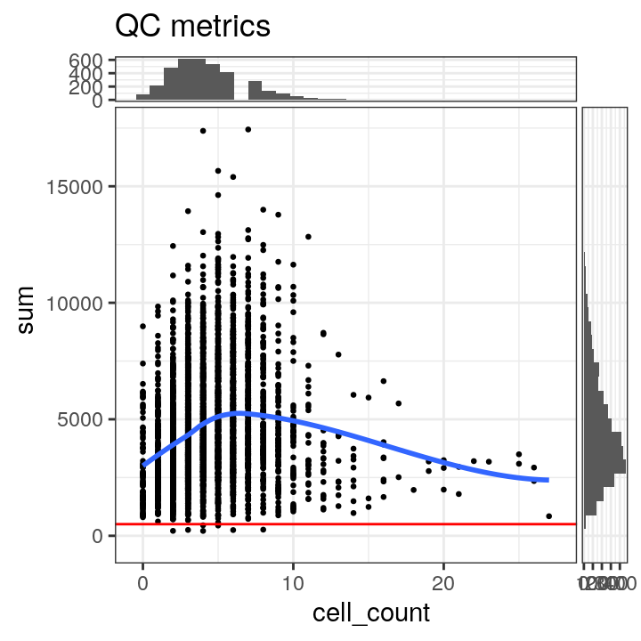

The plot shows that setting a filtering threshold for library size (e.g. at the value shown) does not appear to select for any obvious biologically consistent group of spots.

We set a relatively arbitrary threshold of 500 UMI counts per spot, and then check the number of spots below this threshold.


```r
# select QC threshold for library size
qc_lib_size <- colData(spe)$sum < 500
table(qc_lib_size)
```

```
## qc_lib_size
## FALSE  TRUE 
##  3632     7
```

```r
colData(spe)$qc_lib_size <- qc_lib_size
```

Finally, we also check that the discarded spots do not have any obvious spatial pattern that correlates with known biological features. Otherwise, removing these spots could indicate that we have set the threshold too high, and are removing biologically informative spots.


```r
# check spatial pattern of discarded spots
plotQC(spe, type = "spots", 
       discard = "qc_lib_size")
```


As an aside, here we can also illustrate what happens if we set the threshold too high. For example, if we set the threshold to 2000 UMI counts per spot -- which may also seem like a reasonable value based on the histogram and scatterplot -- then we see a possible spatial pattern in the discarded spots, matching the cortical layers. This illustrates the importance of interactively checking exploratory visualizations when choosing these thresholds.


```r
# check spatial pattern of discarded spots if threshold is too high
qc_lib_size_2000 <- colData(spe)$sum < 2000
colData(spe)$qc_lib_size_2000 <- qc_lib_size_2000
plotQC(spe, type = "spots", 
       discard = "qc_lib_size_2000")
```


For reference, here are the ground truth (manually annotated) cortical layers in this dataset.


```r
# plot ground truth (manually annotated) layers
plotSpots(spe, annotate = "ground_truth", 
          palette = "libd_layer_colors")
```

```
## Warning: Removed 28 rows containing missing values (geom_point).
```


### Number of expressed features

The number of expressed features refers to the number of genes with non-zero UMI counts per spot. This is stored in the column `detected` in the `scater` output.

We use a similar sequence of visualizations to choose a threshold for this QC metric.


```r
# histogram of numbers of expressed genes
hist(colData(spe)$detected, breaks = 20)
```

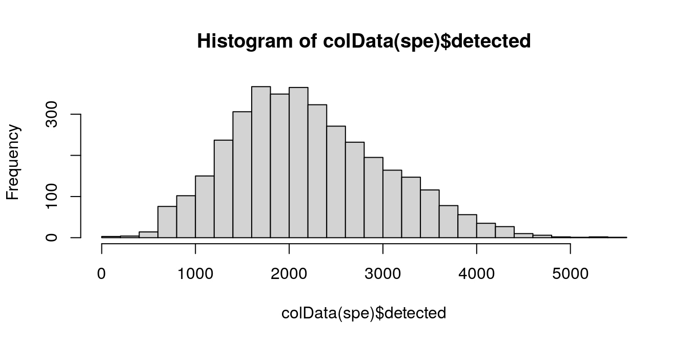


```r
# plot number of expressed genes vs. number of cells per spot
plotQC(spe, type = "scatter", 
       metric_x = "cell_count", metric_y = "detected", 
       threshold_y = 250)
```

```
## `geom_smooth()` using formula 'y ~ x'
```

```
## `stat_bin()` using `bins = 30`. Pick better value with `binwidth`.
## `stat_bin()` using `bins = 30`. Pick better value with `binwidth`.
```


Based on the plots, we select a threshold of 250 expressed genes per spot.


```r
# select QC threshold for number of expressed genes
qc_detected <- colData(spe)$detected < 250
table(qc_detected)
```

```
## qc_detected
## FALSE  TRUE 
##  3634     5
```

```r
colData(spe)$qc_detected <- qc_detected
```


```r
# check spatial pattern of discarded spots
plotQC(spe, type = "spots", 
       discard = "qc_detected")
```

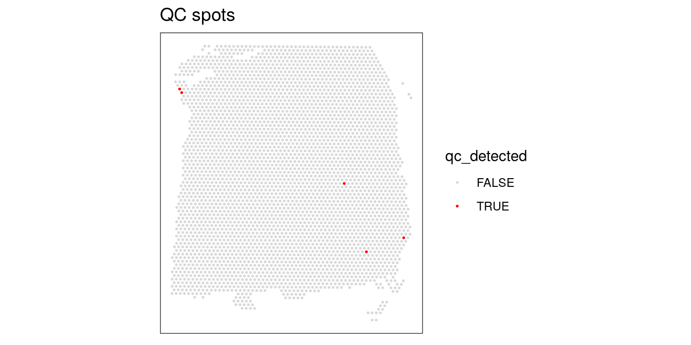

Again, we also check what happens when we set the threshold too high.


```r
# check spatial pattern of discarded spots if threshold is too high
qc_detected_1000 <- colData(spe)$detected < 1000
colData(spe)$qc_detected_1000 <- qc_detected_1000
plotQC(spe, type = "spots", 
       discard = "qc_detected_1000")
```

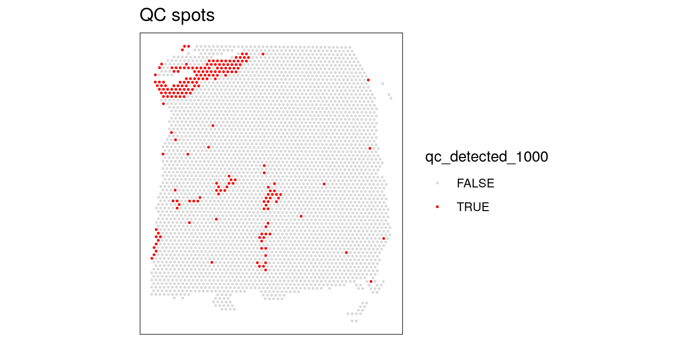


### Proportion of mitochondrial reads

A high proportion of mitochondrial reads indicates cell damage.

We investigate the proportions of mitochondrial reads across spots, and select an appropriate threshold. The proportions of mitochondrial reads per spot are stored in the column `subsets_mito_percent` in the `scater` output.


```r
# histogram of mitochondrial read proportions
hist(colData(spe)$subsets_mito_percent, breaks = 20)
```


```r
# plot mitochondrial read proportion vs. number of cells per spot
plotQC(spe, type = "scatter", 
       metric_x = "cell_count", metric_y = "subsets_mito_percent", 
       threshold_y = 30)
```

```
## `geom_smooth()` using formula 'y ~ x'
```

```
## `stat_bin()` using `bins = 30`. Pick better value with `binwidth`.
## `stat_bin()` using `bins = 30`. Pick better value with `binwidth`.
```

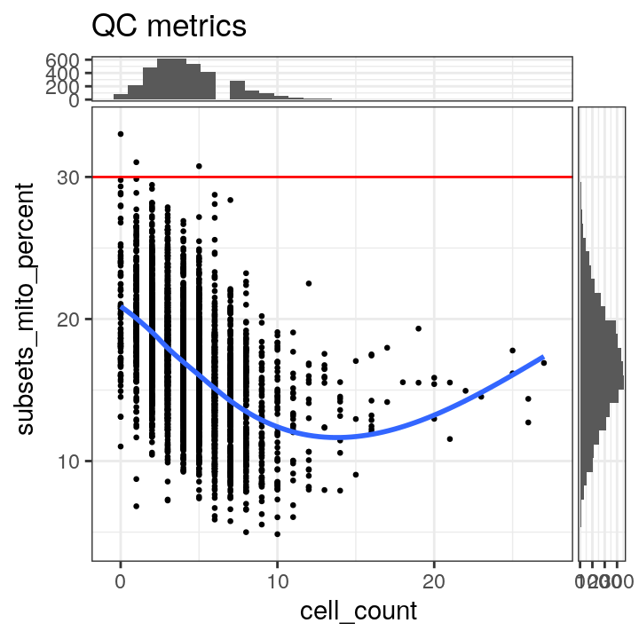

We select a threshold of 30% for the mitochondrial read proportion.


```r
# select QC threshold for mitochondrial read proportion
qc_mito <- colData(spe)$subsets_mito_percent > 30
table(qc_mito)
```

```
## qc_mito
## FALSE  TRUE 
##  3636     3
```

```r
colData(spe)$qc_mito <- qc_mito
```


```r
# check spatial pattern of discarded spots
plotQC(spe, type = "spots", 
       discard = "qc_mito")
```

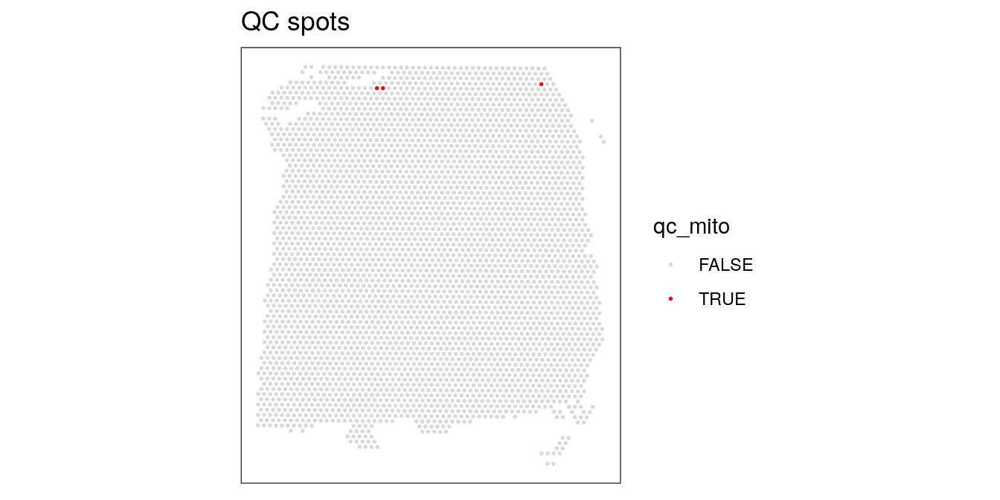

We also check what happens when we set the threshold too low.


```r
# check spatial pattern of discarded spots if threshold is too high
qc_mito_25 <- colData(spe)$subsets_mito_percent > 25
colData(spe)$qc_mito_25 <- qc_mito_25
plotQC(spe, type = "spots", 
       discard = "qc_mito_25")
```

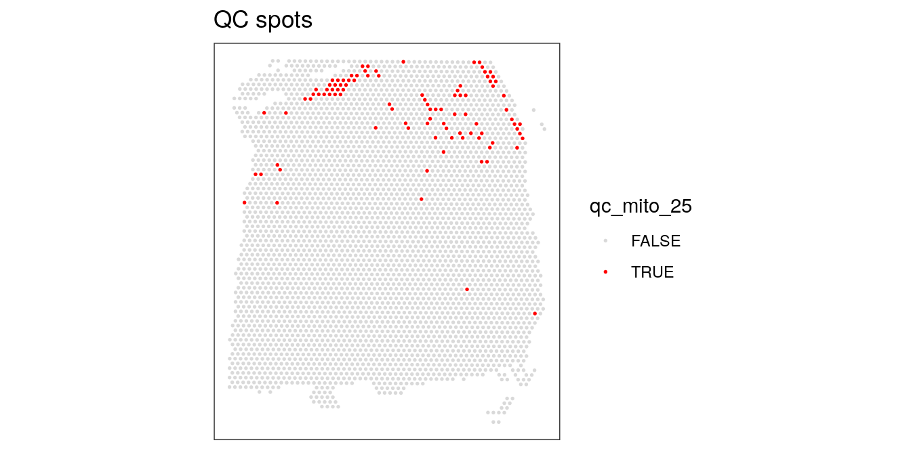


### Number of cells per spot

The number of cells per spot depends on the tissue type and organism.

Here, we check for any outlier values that could indicate problems during cell segmentation.


```r
# histogram of cell counts
hist(colData(spe)$cell_count, breaks = 20)
```

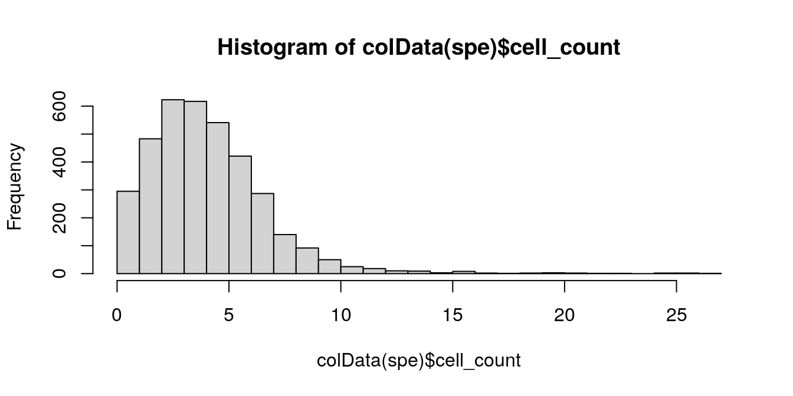

```r
# distribution of cells per spot
tbl_cells_per_spot <- table(colData(spe)$cell_count)
```

We see a tail of very high values, which could indicate problems for these spots. These values are also visible on the scatterplots. Here, we again plot the number of expressed genes vs. cell count, with an added trend.


```r
# plot number of expressed genes vs. number of cells per spot
plotQC(spe, type = "scatter", 
       metric_x = "cell_count", metric_y = "detected", 
       threshold_x = 12)
```

```
## `geom_smooth()` using formula 'y ~ x'
```

```
## `stat_bin()` using `bins = 30`. Pick better value with `binwidth`.
## `stat_bin()` using `bins = 30`. Pick better value with `binwidth`.
```

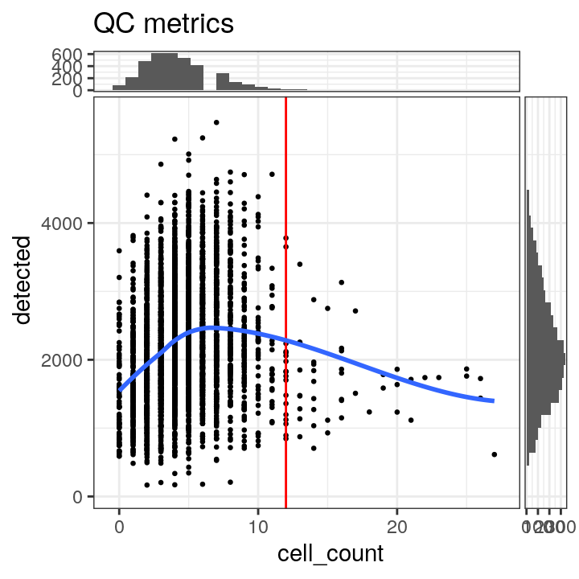

In particular, we see that the spots with very high cell counts also have low numbers of expressed genes. This indicates that the experiments have failed for these spots, and they should be removed.

We select a threshold of 12 cells per spot. The number of spots above this threshold is relatively small, and there is a clear downward trend in the number of expressed genes above this threshold.


```r
# select QC threshold for number of cells per spot
qc_cell_count <- colData(spe)$cell_count > 12
table(qc_cell_count)
```

```
## qc_cell_count
## FALSE  TRUE 
##  3592    47
```

```r
colData(spe)$qc_cell_count <- qc_cell_count
```


```r
# check spatial pattern of discarded spots
plotQC(spe, type = "spots", 
       discard = "qc_cell_count")
```


While there is a spatial pattern to the discarded spots, it does not appear to be correlated with the known biological features (cortical layers). The discarded spots are all on the edges of the tissue. It seems plausible that something has gone wrong with the cell segmentation on the edges of the images, so it makes sense to remove these spots.


### Remove low-quality spots

Now that we have calculated several QC metrics and selected thresholds for each one, we can combine the sets of low-quality spots, and remove them from our object.

We also check again that the combined set of discarded spots does not correspond to any obvious biologically relevant group of spots.


```r
# number of discarded spots for each metric
apply(cbind(qc_lib_size, qc_detected, qc_mito, qc_cell_count), 2, sum)
```

```
##   qc_lib_size   qc_detected       qc_mito qc_cell_count 
##             7             5             3            47
```

```r
# combined set of discarded spots
discard <- qc_lib_size | qc_detected | qc_mito | qc_cell_count
table(discard)
```

```
## discard
## FALSE  TRUE 
##  3582    57
```

```r
# store in object
colData(spe)$discard <- discard
```


```r
# check spatial pattern of combined set of discarded spots
plotQC(spe, type = "spots", 
       discard = "discard")
```

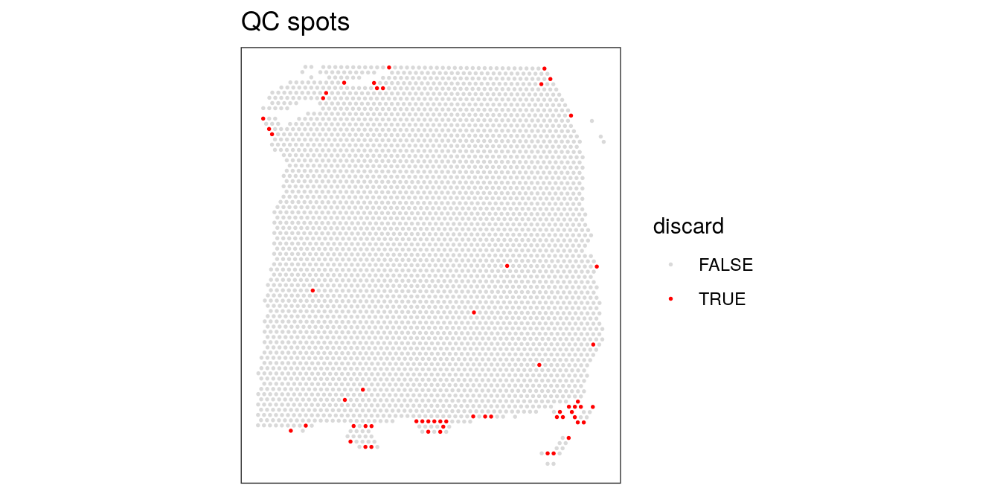


```r
# remove combined set of low-quality spots
spe <- spe[, !colData(spe)$discard]
dim(spe)
```

```
## [1] 33538  3582
```


## Zero-cell and single-cell spots

A particular characteristic of Visium data is that spots can contain zero, one, or multiple cells.

We could also imagine other filtering procedures such as (i) removing spots with zero cells, or (ii) restricting the analysis to spots containing a single cell (which would make the data more similar to scRNA-seq).

However, this would discard a large amount of information. Below, we show the distribution of cells per spot again (up to the filtering threshold of 12 cells per spot from above).


```r
# distribution of cells per spot
tbl_cells_per_spot[1:13]
```

```
## 
##   0   1   2   3   4   5   6   7   8   9  10  11  12 
##  84 211 483 623 617 541 421 287 140  92  50  25  18
```

```r
# as proportions
prop_cells_per_spot <- round(tbl_cells_per_spot / sum(tbl_cells_per_spot), 2)
prop_cells_per_spot[1:13]
```

```
## 
##    0    1    2    3    4    5    6    7    8    9   10   11   12 
## 0.02 0.06 0.13 0.17 0.17 0.15 0.12 0.08 0.04 0.03 0.01 0.01 0.00
```

Only 6% of spots contain a single cell. If we restricted the analysis to these spots only, we would be discarding most of the data.

Removing the spots containing zero cells (2% of spots) would also be problematic, since these spots can also contain biologically meaningful information. For example, in this brain dataset, the regions between cell bodies consists of neuropil (dense networks of axons and dendrites). In our paper [@Maynard2021], we explore the information contained in these neuropil spots.


## Quality control at gene level

The sections above consider quality control at the spot level. In some datasets, it may also be appropriate to apply quality control procedures or filtering at the gene level. For example, certain genes may be biologically irrelevant for downstream analyses.

However, here we make a distinction between quality control and feature selection. Removing biologically uninteresting genes (such as mitochondrial genes) may also be considered as part of feature selection, since there is no underlying experimental procedure that has failed. Therefore, we will discuss gene-level filtering in the [Feature selection] chapter.

