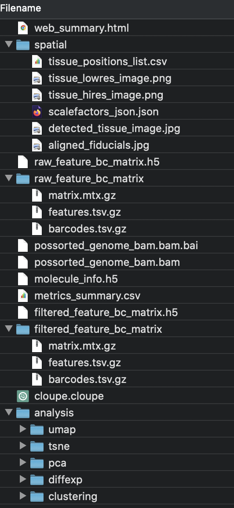
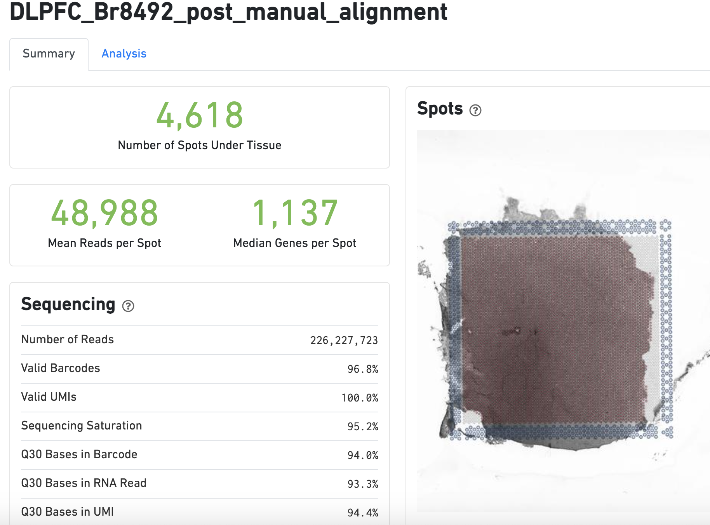

# Space Ranger (Visium)

## Overview

## Installation

More detailed instructions can be found on the [10x Genomics website](https://support.10xgenomics.com/spatial-gene-expression/software/pipelines/latest/installation).

## Memory issues

## Run spaceranger count

Automatic alignment of images

## Output files

(\#fig:unnamed-chunk-1)Figure caption.

## Web summary .html file

(\#fig:unnamed-chunk-2)Figure caption.

## Import outputs into R

