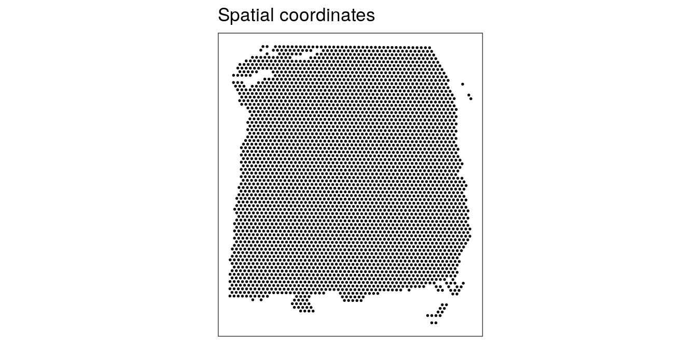

# Visium human DLPFC workflow

This workflow analyzes one sample of human brain from the dorsolateral prefrontal cortex (DLPFC) region, measured using the 10x Genomics Visium platform. This is a condensed version of the analyses shown in the individual analysis chapters in the previous part. For more details on the individual steps, see the previous chapters.


## Description of dataset

This is a 10x Genomics Visium dataset generated from healthy human brain samples from the dorsolateral prefrontal cortex (DLPFC) region.

In the full dataset, there are 12 samples in total, from 3 individuals, with 2 pairs of "spatially adjacent" replicates (serial sections) per individual (4 samples per individual). The individuals and spatially adjacent replicates can be considered as blocking factors. Each sample spans the six layers of the cortex plus white matter in a perpendicular tissue section.

For the examples in this workflow and the analysis chapters, we use a single sample from this dataset (sample 151673), mainly to reduce computational requirements to compile the book.

This dataset is described in our publication @Maynard2021. The full dataset is publicly available through the [spatialLIBD](http://bioconductor.org/packages/spatialLIBD) Bioconductor package, and the analysis code from our paper is provided in the [HumanPilot](https://github.com/LieberInstitute/HumanPilot) GitHub repository. The dataset can also be explored interactively through the [spatialLIBD Shiny web app](http://spatial.libd.org/spatialLIBD/).


## Load data

Here, we load a single sample from this dataset (sample 151673), which is available as a `SpatialExperiment` object from the [STexampleData](https://github.com/lmweber/STexampleData) package.


```r
library(SpatialExperiment)
library(STexampleData)

# load object
spe <- Visium_humanDLPFC()
spe
```

```
## class: SpatialExperiment 
## dim: 33538 4992 
## metadata(0):
## assays(1): counts
## rownames(33538): ENSG00000243485 ENSG00000237613 ... ENSG00000277475
##   ENSG00000268674
## rowData names(3): gene_id gene_name feature_type
## colnames(4992): AAACAACGAATAGTTC-1 AAACAAGTATCTCCCA-1 ...
##   TTGTTTGTATTACACG-1 TTGTTTGTGTAAATTC-1
## colData names(5): cell_count ground_truth sample_id pxl_col_in_fullres
##   pxl_row_in_fullres
## reducedDimNames(0):
## mainExpName: NULL
## altExpNames(0):
## spatialData names(6) : barcode_id in_tissue ... x y
## spatialCoords names(2) : x y
## imgData names(4): sample_id image_id data scaleFactor
```


## Plot data

As an initial check, plot the spatial coordinates (spots) in x-y dimensions on the tissue slide, to check that the object has loaded correctly and that the orientation is as expected.

We use visualization functions from the [ggspavis](https://github.com/lmweber/ggpavis) package to generate plots.


```r
library(ggspavis)
```


```r
# plot spatial coordinates (spots)
plotSpots(spe)
```




## Quality control (QC)

First, we subset the object to keep only spots over tissue. The remaining spots are background spots, which we are not interested in.


```r
# subset to keep only spots over tissue
spe <- spe[, spatialData(spe)$in_tissue == 1]
dim(spe)
```

```
## [1] 33538  3639
```

Next, calculate spot-level QC metrics using the `scater` package [@McCarthy2017], and store the QC metrics in `colData`. See [Quality control] for more details, including explanations of the QC metrics.


```r
library(scater)
```


```r
# identify mitochondrial genes
is_mito <- grepl("(^MT-)|(^mt-)", rowData(spe)$gene_name)
table(is_mito)
```

```
## is_mito
## FALSE  TRUE 
## 33525    13
```

```r
rowData(spe)$gene_name[is_mito]
```

```
##  [1] "MT-ND1"  "MT-ND2"  "MT-CO1"  "MT-CO2"  "MT-ATP8" "MT-ATP6" "MT-CO3" 
##  [8] "MT-ND3"  "MT-ND4L" "MT-ND4"  "MT-ND5"  "MT-ND6"  "MT-CYB"
```

```r
# calculate per-spot QC metrics and store in colData
spe <- addPerCellQC(spe, subsets = list(mito = is_mito))
head(colData(spe), 3)
```

```
## DataFrame with 3 rows and 23 columns
##                    cell_count ground_truth     sample_id pxl_col_in_fullres
##                     <integer>     <factor>   <character>          <integer>
## AAACAAGTATCTCCCA-1          6       Layer3 sample_151673               8468
## AAACAATCTACTAGCA-1         16       Layer1 sample_151673               2807
## AAACACCAATAACTGC-1          5       WM     sample_151673               9505
##                    pxl_row_in_fullres         barcode_id in_tissue array_col
##                             <integer>        <character> <integer> <integer>
## AAACAAGTATCTCCCA-1               9791 AAACAAGTATCTCCCA-1         1        50
## AAACAATCTACTAGCA-1               5769 AAACAATCTACTAGCA-1         1         3
## AAACACCAATAACTGC-1               4068 AAACACCAATAACTGC-1         1        59
##                    array_row         x         y       sum  detected
##                    <integer> <integer> <integer> <numeric> <numeric>
## AAACAAGTATCTCCCA-1       102      8468      9791      8458      3586
## AAACAATCTACTAGCA-1        43      2807      5769      1667      1150
## AAACACCAATAACTGC-1        19      9505      4068      3769      1960
##                    subsets_mito_sum subsets_mito_detected subsets_mito_percent
##                           <numeric>             <numeric>            <numeric>
## AAACAAGTATCTCCCA-1             1407                    13              16.6351
## AAACAATCTACTAGCA-1              204                    11              12.2376
## AAACACCAATAACTGC-1              430                    13              11.4089
##                        total         barcode_id in_tissue array_col array_row
##                    <numeric>        <character> <integer> <integer> <integer>
## AAACAAGTATCTCCCA-1      8458 AAACAAGTATCTCCCA-1         1        50       102
## AAACAATCTACTAGCA-1      1667 AAACAATCTACTAGCA-1         1         3        43
## AAACACCAATAACTGC-1      3769 AAACACCAATAACTGC-1         1        59        19
##                            x         y
##                    <integer> <integer>
## AAACAAGTATCTCCCA-1      8468      9791
## AAACAATCTACTAGCA-1      2807      5769
## AAACACCAATAACTGC-1      9505      4068
```

Select filtering thresholds for the QC metrics by examining distributions using histograms. For additional details, including further exploratory visualizations to select the thresholds, see [Quality control]. Here, we use relatively relaxed thresholds, since the additional exploratory visualizations showed that more stringent thresholds tended to remove groups of spots corresponding to biologically meaningful regions.


```r
# histograms of QC metrics
par(mfrow = c(1, 4))
hist(colData(spe)$sum, xlab = "sum", main = "UMIs per spot")
hist(colData(spe)$detected, xlab = "detected", main = "Genes per spot")
hist(colData(spe)$subsets_mito_percent, xlab = "percent mitochondrial", main = "Percent mito UMIs")
hist(colData(spe)$cell_count, xlab = "number of cells", main = "No. cells per spot")
```


```r
par(mfrow = c(1, 1))

# select QC thresholds
qc_lib_size <- colData(spe)$sum < 500
qc_detected <- colData(spe)$detected < 250
qc_mito <- colData(spe)$subsets_mito_percent > 30
qc_cell_count <- colData(spe)$cell_count > 12

# number of discarded spots for each metric
apply(cbind(qc_lib_size, qc_detected, qc_mito, qc_cell_count), 2, sum)
```

```
##   qc_lib_size   qc_detected       qc_mito qc_cell_count 
##             7             5             3            47
```

```r
# combined set of discarded spots
discard <- qc_lib_size | qc_detected | qc_mito | qc_cell_count
table(discard)
```

```
## discard
## FALSE  TRUE 
##  3582    57
```

```r
# store in object
colData(spe)$discard <- discard
```

Plot the set of discarded spots in the spatial x-y coordinates, to confirm that the spatial distribution of the discarded spots does not correspond to any biologically meaningful regions, which would indicate that we are removing biologically informative spots.


```r
# check spatial pattern of discarded spots
plotQC(spe, type = "spots", discard = "discard")
```


There is some concentration of discarded spots at the edge of the tissue region, which may be due to tissue damage. Importantly, the discarded spots do not correspond to any of the cortical layers of interest.

We filter out the low-quality spots from the object.


```r
# filter low-quality spots
spe <- spe[, !colData(spe)$discard]
dim(spe)
```

```
## [1] 33538  3582
```


## Normalization

Calculate log-transformed normalized counts, using pool-based size factors and deconvolution to the spot level. We use normalization methods from `scater` [@McCarthy2017] and `scran` [@Lun2016], by assuming that these methods can be applied by treating spots as equivalent to cells. Since we have a single sample, there are no blocking factors. For more details, see [Normalization].


```r
library(scran)
```


```r
# quick clustering for pool-based size factors
set.seed(123)
qclus <- quickCluster(spe)
table(qclus)
```

```
## qclus
##   1   2   3   4   5   6   7   8   9  10 
## 372 245 254 744 415 230 394 299 492 137
```

```r
# calculate size factors and store in object
spe <- computeSumFactors(spe, cluster = qclus)

summary(sizeFactors(spe))
```

```
##    Min. 1st Qu.  Median    Mean 3rd Qu.    Max. 
##  0.1334  0.6093  0.8844  1.0000  1.2852  4.2475
```

```r
hist(sizeFactors(spe), breaks = 20)
```


```r
# calculate logcounts (log-transformed normalized counts) and store in object
spe <- logNormCounts(spe)

assayNames(spe)
```

```
## [1] "counts"    "logcounts"
```


## Feature selection

Identify a set of top highly variable genes (HVGs), which will be used to define cell types. We use methods from `scran` [@Lun2016], treating spots as equivalent to cells, and considering only molecular features (gene expression), as described in [Feature selection]. We also first filter out mitochondrial genes, since these are very highly expressed and not of biological interest here.


```r
# remove mitochondrial genes
spe <- spe[!is_mito, ]
dim(spe)
```

```
## [1] 33525  3582
```


```r
# fit mean-variance relationship
dec <- modelGeneVar(spe)

# visualize mean-variance relationship
fit <- metadata(dec)
plot(fit$mean, fit$var, 
     xlab = "mean of log-expression", ylab = "variance of log-expression")
curve(fit$trend(x), col = "dodgerblue", add = TRUE, lwd = 2)
```


```r
# select top HVGs
top_hvgs <- getTopHVGs(dec, prop = 0.1)
length(top_hvgs)
```

```
## [1] 1448
```


## Dimensionality reduction

Run principal component analysis (PCA) to the set of top HVGs, and retain the top 50 principal components (PCs) for further downstream analyses. This is done both to reduce noise and to improve computational efficiency. We also run UMAP on the set of top 50 PCs and retain the top 2 UMAP components for visualization purposes.

We use the computationally efficient implementation of PCA available in `scater` [@McCarthy2017], which uses randomization, and therefore requires setting a random seed for reproducibility.


```r
# compute PCA
set.seed(123)
spe <- runPCA(spe, subset_row = top_hvgs)

reducedDimNames(spe)
```

```
## [1] "PCA"
```

```r
dim(reducedDim(spe, "PCA"))
```

```
## [1] 3582   50
```


```r
# compute UMAP on top 50 PCs
set.seed(123)
spe <- runUMAP(spe, dimred = "PCA")

reducedDimNames(spe)
```

```
## [1] "PCA"  "UMAP"
```

```r
dim(reducedDim(spe, "UMAP"))
```

```
## [1] 3582    2
```

```r
# update column names for easier plotting
colnames(reducedDim(spe, "UMAP")) <- paste0("UMAP", 1:2)
```


## Clustering

Next, we perform clustering to define cell types. Here, we use molecular features (gene expression) only, as described in [Clustering]. We apply graph-based clustering using the Walktrap method implemented in `scran` [@Lun2016], applied to the top 50 PCs calculated on the set of top HVGs.


```r
# graph-based clustering
set.seed(123)
k <- 10
g <- buildSNNGraph(spe, k = k, use.dimred = "PCA")
g_walk <- igraph::cluster_walktrap(g)
clus <- g_walk$membership
table(clus)
```

```
## clus
##    1    2    3    4    5    6 
##  372  916  342 1083  349  520
```

```r
# store cluster labels in column 'label' in colData
colLabels(spe) <- factor(clus)
```

Visualize the clusters by plotting in (i) spatial (x-y) coordinates on the tissue slide, and (ii) UMAP dimensions.

From the visualizations, we can see that the clustering reproduces the known biological structure (cortical layers), although not perfectly. The clusters are also separated in UMAP space, but again not perfectly.


```r
# plot clusters in spatial x-y coordinates
plotSpots(spe, annotate = "label", 
          palette = "libd_layer_colors")
```


```r
# plot ground truth labels in spatial coordinates
plotSpots(spe, annotate = "ground_truth", 
          palette = "libd_layer_colors")
```

```
## Warning: Removed 14 rows containing missing values (geom_point).
```


```r
# plot clusters in UMAP reduced dimensions
plotDimRed(spe, type = "UMAP", 
           annotate = "label", palette = "libd_layer_colors")
```


## Marker genes

Identify marker genes by testing for differential gene expression between clusters. We use the `findMarkers` implementation in `scran` [@Lun2016], using a binomial test, which tests for genes that differ in the proportion expressed vs. not expressed between clusters. This is a more stringent test than the default t-tests, and tends to select genes that are easier to interpret and validate experimentally.


```r
# set gene names as row names for easier plotting
rownames(spe) <- rowData(spe)$gene_name

# test for marker genes
markers <- findMarkers(spe, test = "binom", direction = "up")

# returns a list with one DataFrame per cluster
markers
```

```
## List of length 6
## names(6): 1 2 3 4 5 6
```


```r
library(pheatmap)
```


```r
# plot log-fold changes for one cluster over all other clusters
# selecting cluster 1
interesting <- markers[[1]]
best_set <- interesting[interesting$Top <= 5, ]
logFCs <- getMarkerEffects(best_set)

pheatmap(logFCs, breaks = seq(-5, 5, length.out = 101))
```


```r
# plot log-transformed normalized expression of top genes for one cluster
top_genes <- head(rownames(interesting))

plotExpression(spe, x = "label", features = top_genes)
```


