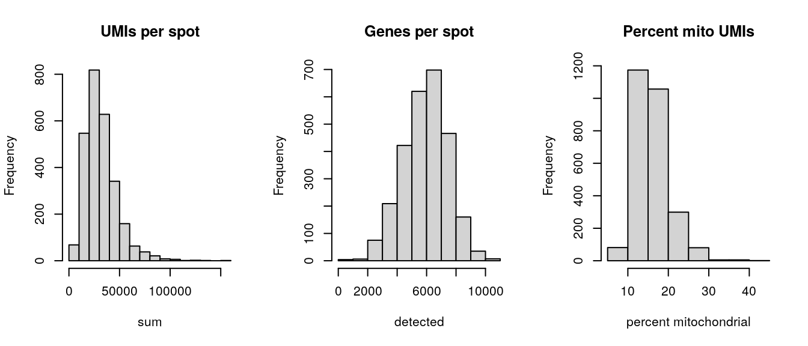
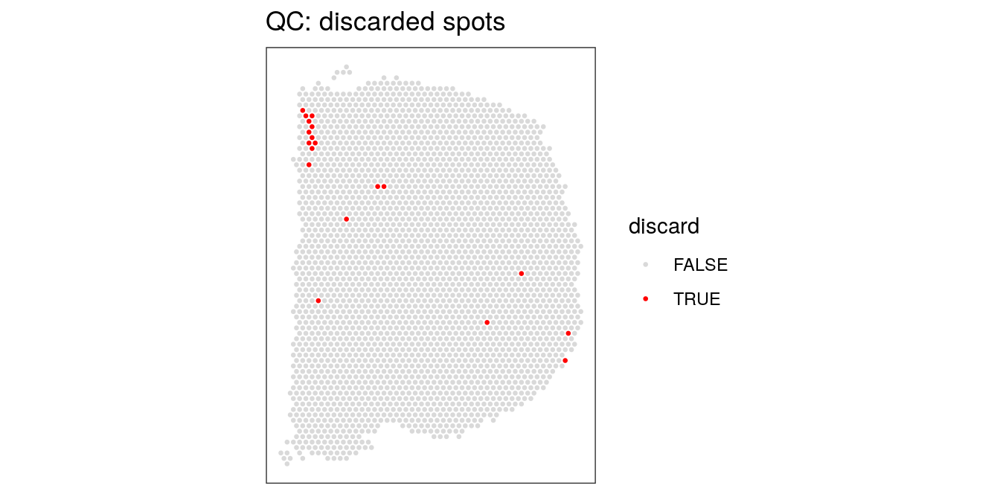
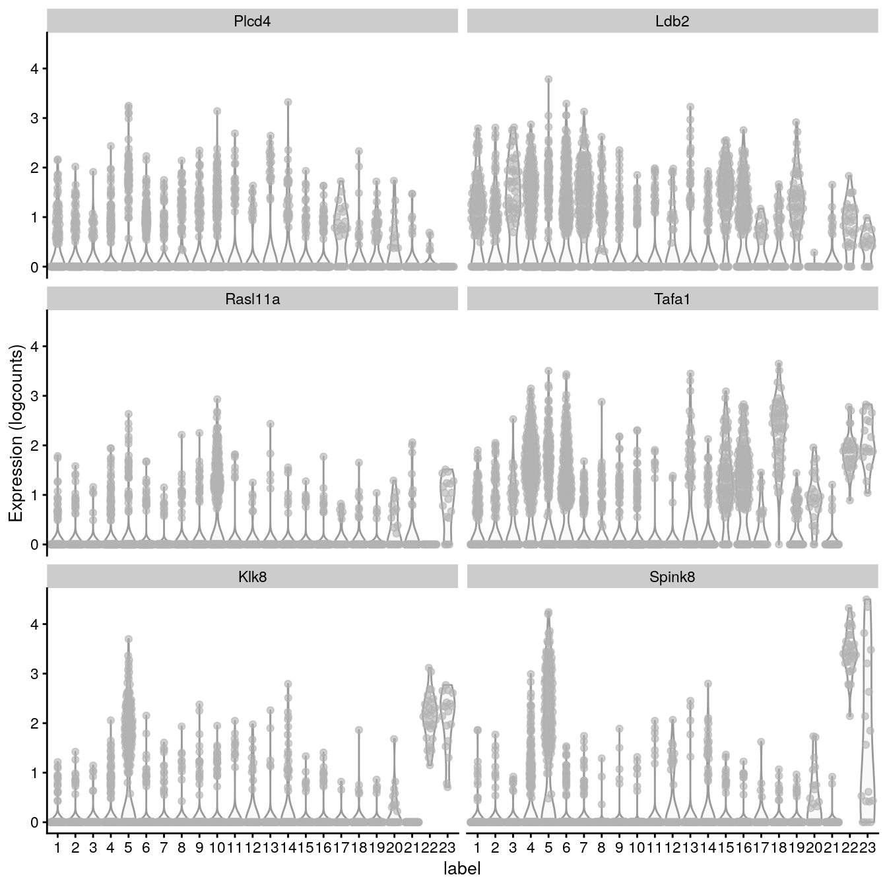

# Mouse coronal workflow

This workflow analyzes a mouse coronal brain section dataset from the 10x Genomics Visium platform. This dataset was generated by 10x Genomics, and the raw data files are publicly available from the [10x Genomics website](https://support.10xgenomics.com/spatial-gene-expression/datasets/1.1.0/V1_Adult_Mouse_Brain).


## Description of dataset

This dataset measures transcriptome-wide gene expression on a Visium slide spanning one hemisphere of a mouse coronal brain section. For experimental details, see the [10x Genomics website](https://support.10xgenomics.com/spatial-gene-expression/datasets/1.1.0/V1_Adult_Mouse_Brain).

Due to the small size of the mouse brain and the dimensions of the Visium slide (6.5mm x 6.5mm), the measurements span an entire brain hemisphere. Therefore, we can use this dataset to compare gene expression profiles between major anatomical regions of the mouse brain. Due to the small size of cells in the mouse brain, each spot can contain up to 50 cells. In this dataset, we do not know the exact number of cells per spot.


## Load data

The dataset is available in `SpatialExperiment` format from the [STexampleData](https://github.com/lmweber/STexampleData) package.


```r
library(SpatialExperiment)
library(STexampleData)

# load object
spe <- load_data("Visium_mouseCoronal")
spe
```

```
## class: SpatialExperiment 
## dim: 32285 4992 
## metadata(0):
## assays(1): counts
## rownames(32285): ENSMUSG00000051951 ENSMUSG00000089699 ...
##   ENSMUSG00000095019 ENSMUSG00000095041
## rowData names(3): gene_id gene_name feature_type
## colnames(4992): AAACAACGAATAGTTC-1 AAACAAGTATCTCCCA-1 ...
##   TTGTTTGTATTACACG-1 TTGTTTGTGTAAATTC-1
## colData names(6): barcode_id sample_id ... pxl_col_in_fullres
##   pxl_row_in_fullres
## reducedDimNames(0):
## mainExpName: NULL
## altExpNames(0):
## spatialData names(4) : barcode_id in_tissue x y
## imgData names(4): sample_id image_id data scaleFactor
```


## Plot data

As an initial check, plot the spatial coordinates (spots) in x-y dimensions on the tissue slide. This confirms that the object has loaded correctly, and the orientation matches the [10x Genomics website](https://support.10xgenomics.com/spatial-gene-expression/datasets/1.1.0/V1_Adult_Mouse_Brain).

We use visualization functions from the [ggspavis](https://github.com/lmweber/ggpavis) package to generate plots.


```r
library(ggspavis)

# plot spatial coordinates (spots)
plotSpots(spe)
```


## Quality control (QC)

Subset object to keep only spots over tissue.


```r
# subset to keep only spots over tissue
spe <- spe[, spatialData(spe)$in_tissue == 1]
dim(spe)
```

```
## [1] 32285  2702
```


Calculate spot-level QC metrics using the `scater` package [@McCarthy2017], and store the QC metrics in `colData`.


```r
library(scater)

# identify mitochondrial genes
is_mito <- grepl("(^MT-)|(^mt-)", rowData(spe)$gene_name)
table(is_mito)
```

```
## is_mito
## FALSE  TRUE 
## 32272    13
```

```r
rowData(spe)$gene_name[is_mito]
```

```
##  [1] "mt-Nd1"  "mt-Nd2"  "mt-Co1"  "mt-Co2"  "mt-Atp8" "mt-Atp6" "mt-Co3" 
##  [8] "mt-Nd3"  "mt-Nd4l" "mt-Nd4"  "mt-Nd5"  "mt-Nd6"  "mt-Cytb"
```

```r
# calculate per-spot QC metrics and store in colData
spe <- addPerCellQC(spe, subsets = list(mito = is_mito))
head(colData(spe), 3)
```

```
## DataFrame with 3 rows and 12 columns
##                            barcode_id   sample_id array_row array_col
##                           <character> <character> <integer> <integer>
## AAACAAGTATCTCCCA-1 AAACAAGTATCTCCCA-1   sample_01        50       102
## AAACAATCTACTAGCA-1 AAACAATCTACTAGCA-1   sample_01         3        43
## AAACACCAATAACTGC-1 AAACACCAATAACTGC-1   sample_01        59        19
##                    pxl_col_in_fullres pxl_row_in_fullres       sum  detected
##                             <integer>          <integer> <numeric> <numeric>
## AAACAAGTATCTCCCA-1               7237               8229     20935      5230
## AAACAATCTACTAGCA-1               1611               4169     14789      3646
## AAACACCAATAACTGC-1               8315               2518     34646      6272
##                    subsets_mito_sum subsets_mito_detected subsets_mito_percent
##                           <numeric>             <numeric>            <numeric>
## AAACAAGTATCTCCCA-1             4036                    13              19.2787
## AAACAATCTACTAGCA-1             3419                    13              23.1185
## AAACACCAATAACTGC-1             5068                    13              14.6280
##                        total
##                    <numeric>
## AAACAAGTATCTCCCA-1     20935
## AAACAATCTACTAGCA-1     14789
## AAACACCAATAACTGC-1     34646
```


Select filtering thresholds for the QC metrics by examining distributions using histograms.


```r
# histograms of QC metrics
par(mfrow = c(1, 3))
hist(colData(spe)$sum, xlab = "sum", main = "UMIs per spot")
hist(colData(spe)$detected, xlab = "detected", main = "Genes per spot")
hist(colData(spe)$subsets_mito_percent, xlab = "percent mitochondrial", main = "Percent mito UMIs")
```



```r
par(mfrow = c(1, 1))

# select QC thresholds
qc_lib_size <- colData(spe)$sum < 5000
qc_detected <- colData(spe)$detected < 1000
qc_mito <- colData(spe)$subsets_mito_percent > 30

# number of discarded spots for each QC metric
apply(cbind(qc_lib_size, qc_detected, qc_mito), 2, sum)
```

```
## qc_lib_size qc_detected     qc_mito 
##           9           4          11
```

```r
# combined set of discarded spots
discard <- qc_lib_size | qc_detected | qc_mito
table(discard)
```

```
## discard
## FALSE  TRUE 
##  2683    19
```

```r
# store in object
colData(spe)$discard <- discard
```


Plot discarded spots in x-y coordinates on the tissue slide to check if there is any biologically meaningful spatial pattern. This would be problematic, since it would mean we are removing biologically informative spots.

We use QC visualization functions from the [spatzli](https://github.com/lmweber/spatzli) package to generate plots.


```r
library(spatzli)

# check spatial pattern of discarded spots
plotQCspots(spe, discard = "discard")
```




There is one small region with some concentrated discarded spots at the top-left. However, this does not appear to correspond to any specific known anatomical region of interest. We assume that these are low-quality spots, and filtering them out will not cause problems in the biological interpretation.

We filter out the low-quality spots from the object.


```r
# filter low-quality spots
spe <- spe[, !colData(spe)$discard]
dim(spe)
```

```
## [1] 32285  2683
```


## Normalization

Next, we calculate log-transformed normalized counts, using pool-based size factors and deconvolution to the spot level, using methods from `scater` [@McCarthy2017] and `scran` [@Lun2016]. Since we have a single sample, there are no blocking factors in the experimental design.


```r
library(scran)

# quick clustering for pool-based size factors
set.seed(123)
qclus <- quickCluster(spe)
table(qclus)
```

```
## qclus
##   1   2   3   4   5   6   7   8   9  10  11  12 
## 178 162 255 450 274 235 320 250 105 119 131 204
```

```r
# calculate size factors and store in object
spe <- computeSumFactors(spe, cluster = qclus)

summary(sizeFactors(spe))
```

```
##    Min. 1st Qu.  Median    Mean 3rd Qu.    Max. 
##  0.1009  0.6032  0.8985  1.0000  1.2649  6.0391
```

```r
hist(log10(sizeFactors(spe)), xlab = "log10 (size factors)", main = "Size factors")
```


```r
# calculate logcounts (log-transformed normalized counts) and store in object
spe <- logNormCounts(spe)

assayNames(spe)
```

```
## [1] "counts"    "logcounts"
```


## Feature selection

Identify a set of top highly variable genes (HVGs), which will be used to define cell types. We use methods from `scran` [@Lun2016], and first filter out mitochondrial genes (since these are very highly expressed and not of biological interest here).


```r
# remove mitochondrial genes
spe <- spe[!is_mito, ]
dim(spe)
```

```
## [1] 32272  2683
```


```r
# fit mean-variance relationship
dec <- modelGeneVar(spe)

# visualize mean-variance relationship
fit <- metadata(dec)
plot(fit$mean, fit$var, 
     xlab = "mean of log-expression", ylab = "variance of log-expression")
curve(fit$trend(x), col = "dodgerblue", add = TRUE, lwd = 2)
```


```r
# select top HVGs
top_hvgs <- getTopHVGs(dec, prop = 0.1)
length(top_hvgs)
```

```
## [1] 1216
```


Note there are a few extremely highly expressed genes, which influence the fitted mean-variance relationship. We check the names of these genes to decide whether they should be removed as outliers.


```r
# identify outlier genes
rev(sort(fit$mean))[1:3]
```

```
## ENSMUSG00000115783 ENSMUSG00000098178 ENSMUSG00000024661 
##          10.992042           9.904624           7.370274
```

```r
outlier_ids <- names(rev(sort(fit$mean))[1:3])

rowData(spe)[outlier_ids, ]
```

```
## DataFrame with 3 rows and 3 columns
##                               gene_id   gene_name    feature_type
##                           <character> <character>     <character>
## ENSMUSG00000115783 ENSMUSG00000115783         Bc1 Gene Expression
## ENSMUSG00000098178 ENSMUSG00000098178     Gm42418 Gene Expression
## ENSMUSG00000024661 ENSMUSG00000024661        Fth1 Gene Expression
```

These appear to be biologically meaningful genes, so we leave them in.


## Dimensionality reduction

Run principal component analysis (PCA) using `scater` [@McCarthy2017], and retain the top 50 principal components (PCs) for downstream analyses. Also run UMAP on the top 50 PCs, and retain the top 2 UMAP components for visualization purposes.


```r
# compute PCA
set.seed(123)
spe <- runPCA(spe, subset_row = top_hvgs)

reducedDimNames(spe)
```

```
## [1] "PCA"
```

```r
dim(reducedDim(spe, "PCA"))
```

```
## [1] 2683   50
```


```r
# compute UMAP on top 50 PCs
set.seed(123)
spe <- runUMAP(spe, dimred = "PCA")

reducedDimNames(spe)
```

```
## [1] "PCA"  "UMAP"
```

```r
dim(reducedDim(spe, "UMAP"))
```

```
## [1] 2683    2
```

```r
# update column names for plotting functions
colnames(reducedDim(spe, "UMAP")) <- paste0("UMAP", 1:2)
```


## Clustering

Perform clustering to define cell types. We apply graph-based clustering using the Walktrap method implemented in `scran` [@Lun2016], applied to the top 50 PCs calculated on the set of top HVGs.


```r
# graph-based clustering
set.seed(123)
k <- 10
g <- buildSNNGraph(spe, k = k, use.dimred = "PCA")
g_walk <- igraph::cluster_walktrap(g)
clus <- g_walk$membership
table(clus)
```

```
## clus
##   1   2   3   4   5   6   7   8   9  10  11  12  13  14  15  16  17  18  19  20 
## 125 126  61 229 241 283 165 132 161 267 122  43  99  94 101 161  26  58  64  24 
##  21  22  23 
##  51  32  18
```

```r
# store cluster labels in column 'label' in colData
colLabels(spe) <- factor(clus)
```


Visualize the clusters by plotting in (i) spatial x-y coordinates on the tissue slide, and (ii) UMAP dimensions. We use plotting functions from the [ggspavis](https://github.com/lmweber/ggpavis) package.


```r
library(ggspavis)

# define custom color palette
colors <- unname(palette.colors(palette = "Polychrome 36"))

# plot clusters in spatial x-y coordinates
plotSpots(spe, discrete = "label", palette = colors)
```


```r
# plot clusters in UMAP dimensions
plotDimRed(spe, type = "UMAP", discrete = "label", palette = colors)
```


## Marker genes

Identify marker genes by testing for differential gene expression between clusters, using the binomial test implemented in `findMarkers` in `scran` [@Lun2016].


```r
# set gene names as row names for visualization purposes
rownames(spe) <- rowData(spe)$gene_name

# test for marker genes
markers <- findMarkers(spe, test = "binom", direction = "up")

# returns a list with one DataFrame per cluster
markers
```

```
## List of length 23
## names(23): 1 2 3 4 5 6 7 8 9 10 11 12 13 14 15 16 17 18 19 20 21 22 23
```


```r
library(pheatmap)

# plot log-fold changes for one cluster over all other clusters
# selecting cluster 5
interesting <- markers[[5]]
best_set <- interesting[interesting$Top <= 5, ]
logFCs <- getMarkerEffects(best_set)

pheatmap(logFCs, breaks = seq(-5, 5, length.out = 101))
```


```r
# plot log-transformed normalized expression of top genes for one cluster
top_genes <- head(rownames(interesting))

plotExpression(spe, x = "label", features = top_genes)
```




